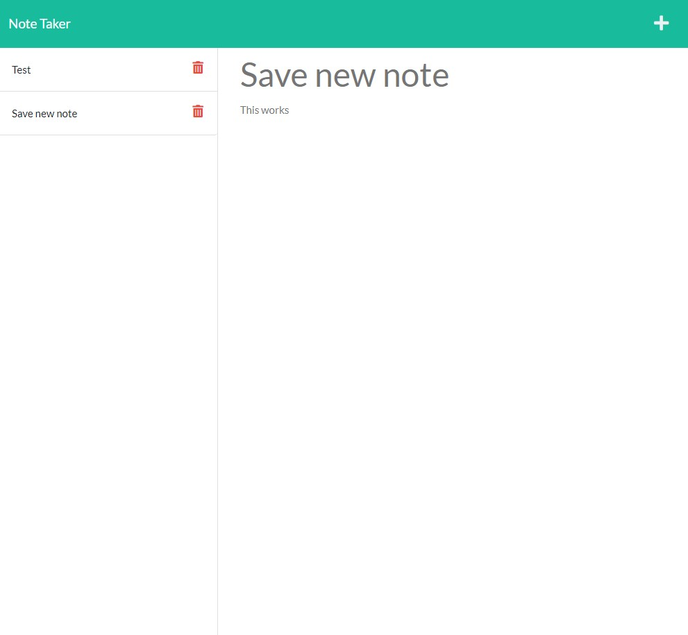

# Note Taking Application

  ## Description
  This application allows users to enter notes and store them in a database. We are able to leverage routes for both HTML pages as well as for notes found in the application. Notes are pulled when the page is loaded, and stored on the left hand side. When you enter a new note, you are given the option to save. Clicking saved notes displays them in the center of the page, however does not allow you to write over them. Future functionality includes the ability to delete. 
  ## Table of Contents

  * [Installation](#installation)
  * [Usage](#usage)
  * [Resources](#resources)

  ## Installation
  
          npm i

  ## Usage

  After installing the necessary packages, in the command line run npm start to launch the server. 

  ## Resources

  * HTML
  * CSS
  * Javascript
  * Node
  * Express
  * Path
  

  

  ## Questions

  Find a link to the full repository at https://github.com/asecord92

  Deployed Application: https://asecord-note-taker1.herokuapp.com/

  For further questions please contact me at [ats92@cox.net](mailto:ats92@cox.net)

